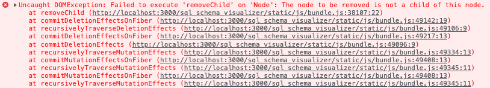

# Using regular links

:calendar: **Last edited on Feb 5, 2023**

You may have noticed that Visualizer uses regular `<a>` tags for navigation instead of React's `<Link>` components.

The reason is the following exception that's thrown when you follow a link to render another dataset:

## Github Pages

Since we're using static links, we need to generate static pages so links like `/databases/bindle` work on a live website.

Good news, is that we simply need to clone a built `index.html` file for every database.
